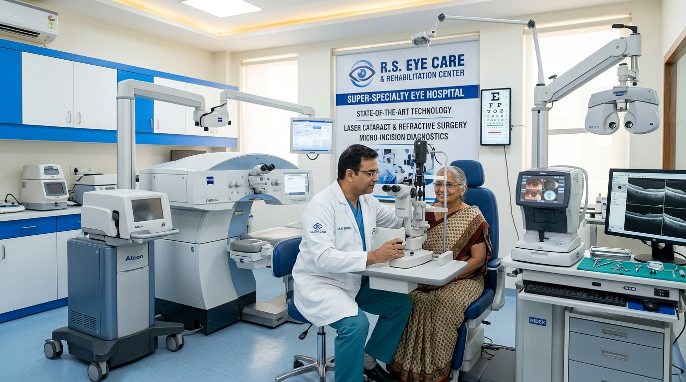

# R.S. Eye Care & Rehabilitation Center

> **Premier Super-Specialty Ophthalmology Hospital, Low Vision Rehabilitation & Prescription Optical Platform**



<div align="center">

[](https://nextjs.org/)
[](https://react.dev/)
[](https://tailwindcss.com/)
[](https://mongoosejs.com/)
[](https://github.com/)

</div>

---

## 👁️ Executive Summary

**R.S. Eye Care & Rehabilitation Center, Etah** is an enterprise-grade digital healthcare platform engineered specifically for Western Uttar Pradesh's leading ophthalmic hospital. 

The platform provides a seamless, zero-friction experience for patients seeking Micro-Incision Cataract Surgery (MICS), LASIK, Glaucoma treatment, Cornea care, Pediatric Ophthalmology, and Low Vision Rehabilitation, while powering an integrated prescription optical store and hospital administration portal.

---

## ✨ Key Features & Capability Matrix

- **⚡ Direct OPD Token Booking**: Zero-payment friction; generates instant OPD registration tokens (`RS-ETAH-YYYYMMDD-XXXX`).
- **🎨 Tactile 3D Neumorphism UI**: Extruded and inset design system built with dual soft shadows (`#c2cee0` / `#ffffff`) on `#ebf1f6` canvas.
- **👨‍⚕️ Senior Doctor Directory**: Live OPD chamber timings, qualification details, and direct checkup booking.
- **👓 In-House Optical Store Showcase**: Titanium rimless and flexi-acetate frames compatible with digital blue-cut anti-glare and progressive HD lenses.
- **📊 Hospital Admin Dashboard**: Real-time management of OPD appointments, token status updates (`BOOKED`, `CONFIRMED`, `COMPLETED`, `CANCELLED`), and optical inventory CRUD operations.
- **🔍 SEO & Healthcare JSON-LD Schemas**: Built-in Google `MedicalClinic` structured metadata for top local search visibility.

---

## 🏗️ Technical Architecture & Standards

Built in compliance with the **RSEyeCare Architectural Governance Framework** in [`.agents/rules/`](file:///d:/github/NEXT%20Project/eye_center/.agents/rules/):

```
                               ┌────────────────────────────────┐
                               │   Next.js 16 App Router UI     │
                               │  (RSC + Neumorphic CSS System) │
                               └───────────────┬────────────────┘
                                               │ HTTP / REST API
                               ┌───────────────▼────────────────┐
                               │  /api/v1/user | /api/v1/admin  │
                               └───────────────┬────────────────┘
                                               │ Route Delegation
                               ┌───────────────▼────────────────┐
                               │  src/core/Http/Controllers/    │
                               └───────────────┬────────────────┘
                                               │ Business Logic
                               ┌───────────────▼────────────────┐
                               │     src/core/Services/         │
                               └───────────────┬────────────────┘
                                               │ Mongoose (.lean())
                               ┌───────────────▼────────────────┐
                               │       MongoDB Database         │
                               └────────────────────────────────┘
```

1. **Strict MVC Pattern**: Route handlers in [`src/app/api/v1/`](file:///d:/github/NEXT%20Project/eye_center/src/app/api/v1/) only mount controllers. Business logic resides in [`src/core/Http/Controllers/`](file:///d:/github/NEXT%20Project/eye_center/src/core/Http/Controllers/) and data access in [`src/core/Services/`](file:///d:/github/NEXT%20Project/eye_center/src/core/Services/).
2. **High-Performance Data Layer**: Reads use `.lean()` queries to eliminate Mongoose document instantiation overhead.
3. **Compound Text Indexes**: Schemas include compound text indexes for instant search across doctors, specialties, and treatments.
4. **Standardized Response Envelope**: All API endpoints return standardized JSON structures:
   ```json
   {
     "success": true,
     "message": "OPD Appointment booked successfully!",
     "data": { ... },
     "error": null
   }
   ```

---

## 📁 Repository Structure

```text
eye_center/
├── .agents/                      # Architecture & Governance Directives
│   └── rules/                    # 10 Domain Rule Specs (Auth, DB, GEO, SEO, Security, etc.)
├── public/
│   └── images/                   # Optimized Hospital & Optical Store Images
├── src/
│   ├── app/                      # Next.js 16 App Router Pages & API Routes
│   │   ├── admin/                # Hospital Admin Dashboard Page
│   │   ├── api/v1/               # Versioned RESTful APIs (/user/* & /admin/*)
│   │   ├── optical/              # Optical Store Showcase Page
│   │   ├── globals.css           # 3D Neumorphism CSS System Tokens
│   │   ├── layout.js             # Root Layout & MedicalClinic Schema
│   │   └── page.js               # Main Landing Page
│   ├── components/               # Tactile Neumorphic React Components
│   │   ├── AppointmentModal.jsx  # OPD Booking Modal
│   │   ├── BentoGridServices.jsx # Featured Eye Treatments Bento Grid
│   │   ├── DoctorSection.jsx     # Senior Ophthalmologist Cards
│   │   ├── Footer.jsx            # Hospital Location & Emergency Contacts
│   │   ├── HeroBanner.jsx        # Interactive Hospital Slider & Stats
│   │   ├── Navbar.jsx            # Main Navigation Bar
│   │   └── OpticalShowcase.jsx   # Frame & Power Lens Store Showcase
│   └── core/                     # Core Backend Application Code
│       ├── Database/             # Mongoose Connection Handler
│       ├── Http/
│       │   └── Controllers/      # Controller Request & Response Envelopes
│       ├── Models/               # Mongoose Schemas (Appointment, Doctor, EyeTreatment, OpticalFrame)
│       └── Services/             # Database Queries & Business Logic
├── next.config.mjs               # Next.js Configuration
├── package.json                  # Dependencies & Scripts
└── README.md                     # Project Documentation
```

---

## 🔌 API Reference Guide

### 🟢 Patient & Public API Endpoints (`/api/v1/user/`)

| Method | Route | Description |
| :--- | :--- | :--- |
| `POST` | `/api/v1/user/appointments` | Register OPD appointment & generate instant token (`RS-ETAH-...`) |
| `GET` | `/api/v1/user/appointments?token=...` | Retrieve patient appointment details by token number |
| `GET` | `/api/v1/user/doctors` | List active senior ophthalmologists & doctor schedules |
| `GET` | `/api/v1/user/treatments` | Fetch featured eye treatments (MICS, LASIK) & optical store frames |
| `POST` | `/api/v1/user/seed` | Initialize database with default hospital doctors, treatments & frames |

### 🔵 Hospital Admin API Endpoints (`/api/v1/admin/`)

| Method | Route | Description |
| :--- | :--- | :--- |
| `GET` | `/api/v1/admin/appointments` | List all patient OPD appointment bookings |
| `PUT` | `/api/v1/admin/appointments` | Update appointment status (`BOOKED`, `CONFIRMED`, `COMPLETED`, `CANCELLED`) |
| `GET` | `/api/v1/admin/optical` | List optical frames inventory in store |
| `POST` | `/api/v1/admin/optical` | Add a new frame to the optical store |
| `DELETE` | `/api/v1/admin/optical?id=...` | Delete a frame item from the optical store |

---

## 🛠️ Getting Started & Installation

### Prerequisites
- **Node.js**: `v18.x` or `v20.x`
- **MongoDB**: Local MongoDB server or MongoDB Atlas connection string

### Environment Configuration
Create a `.env.local` file in the project root:

```env
MONGODB_URI=mongodb://127.0.0.1:27017/rs_eye_center
```

### Installation Steps

```bash
# 1. Clone or navigate to the repository
cd eye_center

# 2. Install dependencies
npm install

# 3. Start the local development server
npm run dev
```

Open [http://localhost:3000](http://localhost:3000) in your browser.

### Production Deployment

```bash
# Build production bundle
npm run build

# Run production server
npm run start
```

---

## 🔒 Security & Compliance Governance

This project is governed by strict policies:
- **No Payment Gateway Key Storage**: Online payment SDKs are disabled by specification.
- **PII Redaction**: Patient healthcare data and contact details are redacted from server log outputs.
- **NoSQL Injection Sanitization**: Input fields are stripped of MongoDB operator vectors (`$` and `{}`).

---

## 📄 Hospital Details & Attribution

**R.S. Eye Care & Rehabilitation Center**  
📍 GT Road, Near Railway Crossing, Etah, Uttar Pradesh — 207001  
📞 Emergency Helpline: +91 98765 43210  
🕒 OPD Timings: Mon – Sat: 9:30 AM – 7:00 PM  

*Designed and engineered for R.S. Eye Care & Rehabilitation Center, Etah. All rights reserved.*

